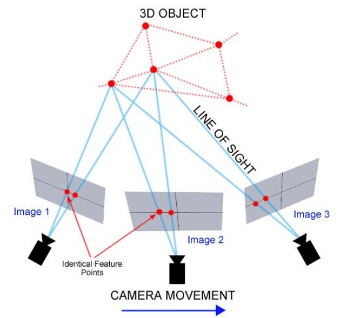
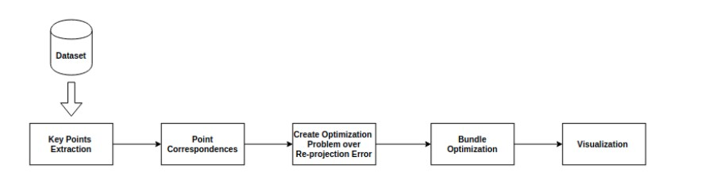
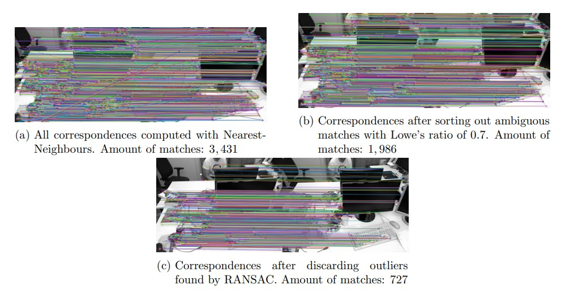
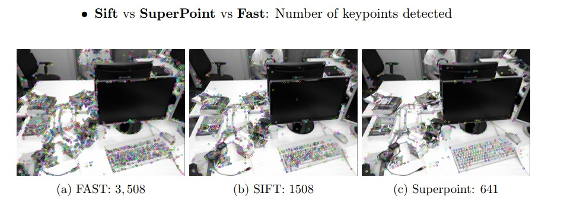
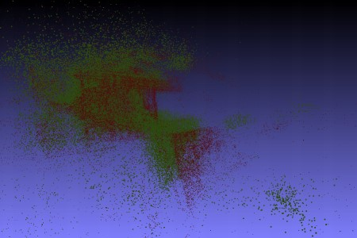

__Team Project__

The projects goal is to show a sample application of Bundle Adjustment in reconstructing 3D
scenes, and it involves three major steps of key features finding and matching, geometric estimation, and recovering the 3D structure of the scene using bundle adjustment. Furthermore, we are going to explore several implementations of different stages of the pipeline of bundle
adjustment using the [**BAL Dataset**](https://grail.cs.washington.edu/projects/bal/).

**Finding correspondences between images**

For computing key points and their descriptors, images are converted to gray scale, then we
utilized three different methods: Scale Invariant Feature Transform (SIFT), SuperPoint which is a self-supervised learning model for interest point detection and description, and
Features from Accelerated Segment Test (FAST). Experiments show, that FAST finds
the most correspondences and therefore, we further used it in the bundle adjustment. The
computation of the feature descriptors is done with SIFT. The feature matching between two
images is done by identifying their first and also their second nearest neighbours (see Fig. 5a).
The latter helps for removing ambiguous correspondences by applying Lowe’s ratio test (see Fig.
5b) with a threshold R = 0.7. The matches still contain outliers which can harm the optimization
problem. Therefore, we use Random Sample Consensus (RANSAC) to find outliers and discard
them (see Fig. 3c). For implementing these algorithms, we used the OpenCV library.

**Constructing the Optimization Problem**

After initialization of rotation, translation and valid tracks of matching keypoints across multiple images, Bundle Adjustment optimization can be constructed. Optimization problem is
formulated as a non-linear least squares problem. Cost function is defined as the error between
the back-projected 3D point and the observed point on the image plane. By minimizing the cost
function the aim is to recover camera parameters and 3D positions of the keypoints.

To solve the minimization problem, Ceres library is used. We solved the formulation with
Levenberg Marquardt Algorithm and used Dense Schur solver to leverage from the special structure that the Jacobian matrix of the re-projection error has.

**Experiment and Analysis**

In the above pictures we see a comparison between the three keypoint extraction techniques
that we used. The most efficient in tracking keypoints is the FAST. FAST tracked almost
double as many keypoints as SIFT did. Superpoint, the deep learning based keypoint extractor,
managed to track approximately 641 keypoints in average between two frames. This made it
less practical than SIFT and FAST, so we proceeded with the other two approaches.

**Obtained Optimized 3D Points**

On the picture above we can see the resulting 3D points that we got after the optimization
(red) as opposed to their location before the optimization (green). The resulting 3D Points for
the BAL dataset are almost applied with the ground truth.

This project was developed using **C++**.
